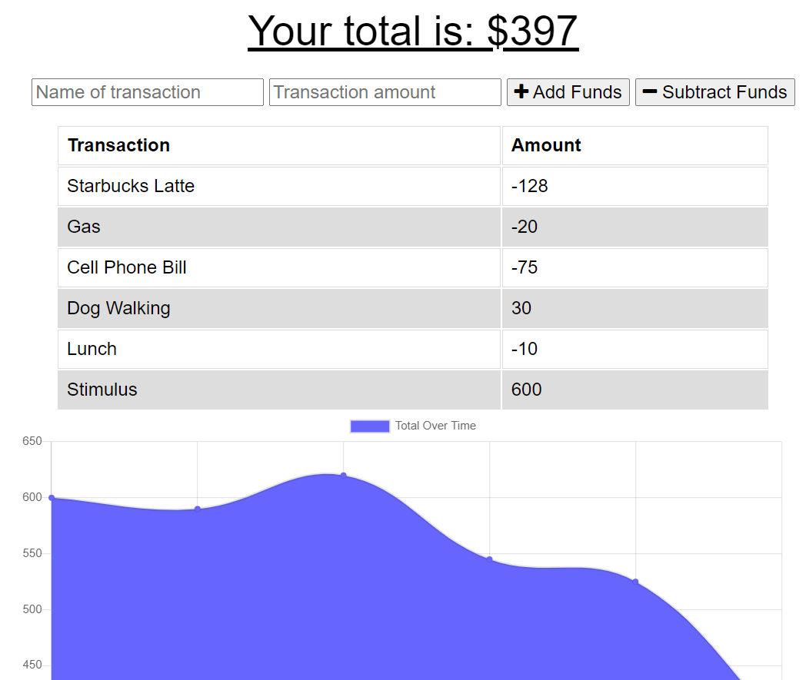

# Budget-Tracker

## Description

a progressive web app (PWA) that allows user to track personal financial transactions on- or offline

Try it out at: https://budget-tracker-kcushing1.herokuapp.com/

## Table of Contents

- [Demonstration](#demonstration)
- [Installation](#installation)
- [Usage](#usage)
- [License](#license)
- [Contributing](#contributing)
- [Questions](#questions)

## Demonstration

## Installation

This app uses node, and mongoDB. Using the command line, type "npm install" or "npm i" to start. Once running online on your browser, it will set up a service worker and indexedDB store.

## Usage

Use the deployed app at: https://budget-tracker-kcushing1.herokuapp.com/

Or download and install to your computer.

## License

This project is licensed with MIT

## Contributing

Fork the repo, make changes, and push those changes using git.

## Questions

https://github.com/kcushing1

If you have any additional questions, please send an email to kasey.cushing@gmail.com
